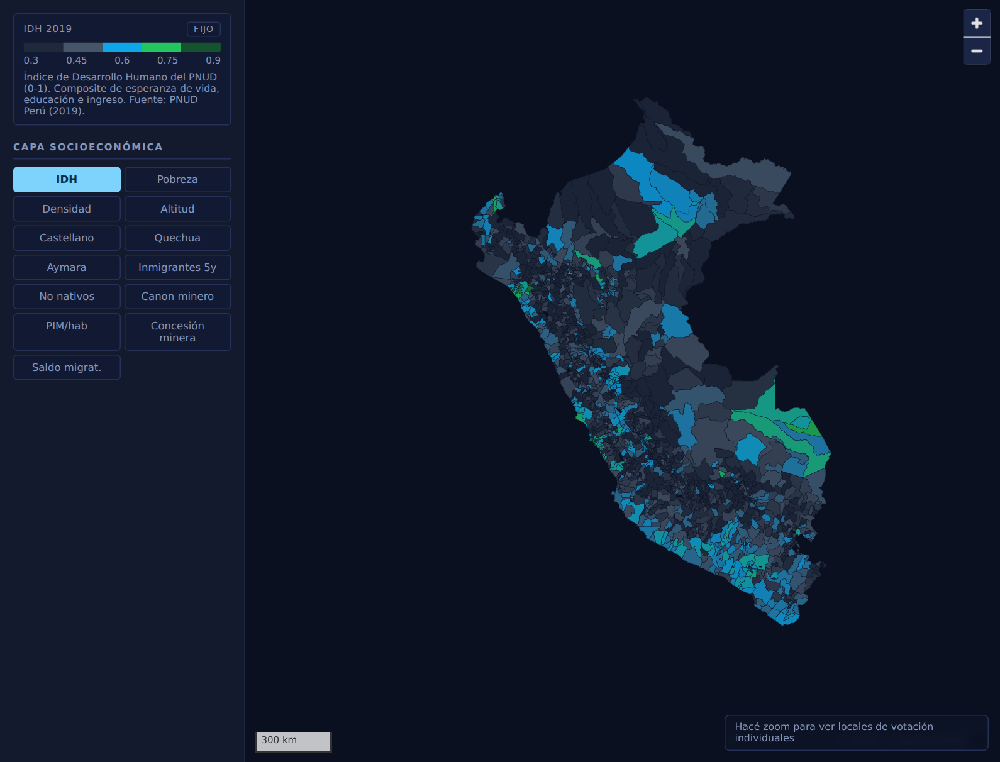
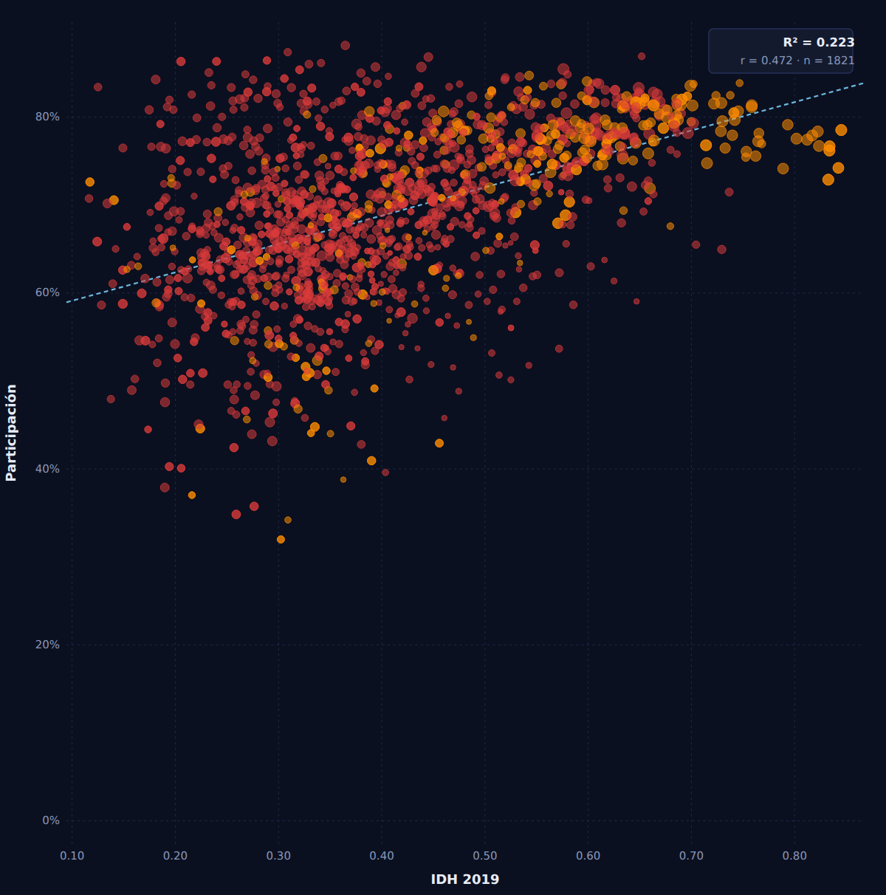

# Mapas

A territorial analysis workspace developed at Sustantiva. Explore socioeconomic indicators, electoral results and geographic layers, compare places and periods, and investigate relationships between variables.

## Territorial analysis

Mapas combines socioeconomic indicators and geographic layers for territorial analysis. Available data includes human development, poverty, languages, migration and infrastructure, with sources and geographic scales identified in the interface.

*District-level Human Development Index. Source displayed in the application: UNDP Peru, 2019. Basemap omitted in this capture.*

## Variable comparisons

Scatter plots support comparisons between indicators, with geographic filters and aggregation controls for different territorial scales. The example below relates human development to turnout in the 2021 presidential runoff. Each point represents a district; point size reflects the electorate and color identifies the winning candidate.

*HDI 2019 × turnout, 2021 runoff. Red: Castillo; orange: Fujimori. The plot shows an aggregate association, not an explanation of individual voting behavior.*

The workspace includes a correlation matrix and an outlier list to help identify places worth a closer look. This example connects two datasets from different years; keeping their dates visible is part of interpreting the comparison.

## Working across territories

Mapas supports multiple country datasets. Available comparisons, geographic levels and indicators follow the coverage of each source. Historical comparisons and time-based layers extend the same workflow where the data supports them.

Territorial layers retain their original geographic support: a provincial observation stays provincial instead of being repeated across districts as if it were a finer estimate.

## Behind the workspace

Python pipelines prepare geographic and statistical data for a TypeScript interface built with MapLibre. Versioned data contracts connect source preparation, country-specific capabilities and the analytical views.
